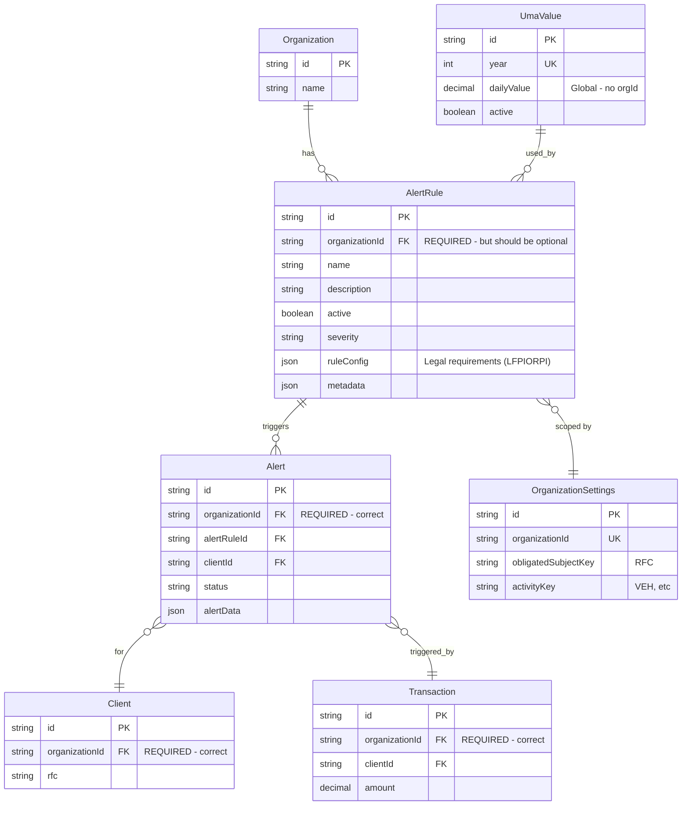
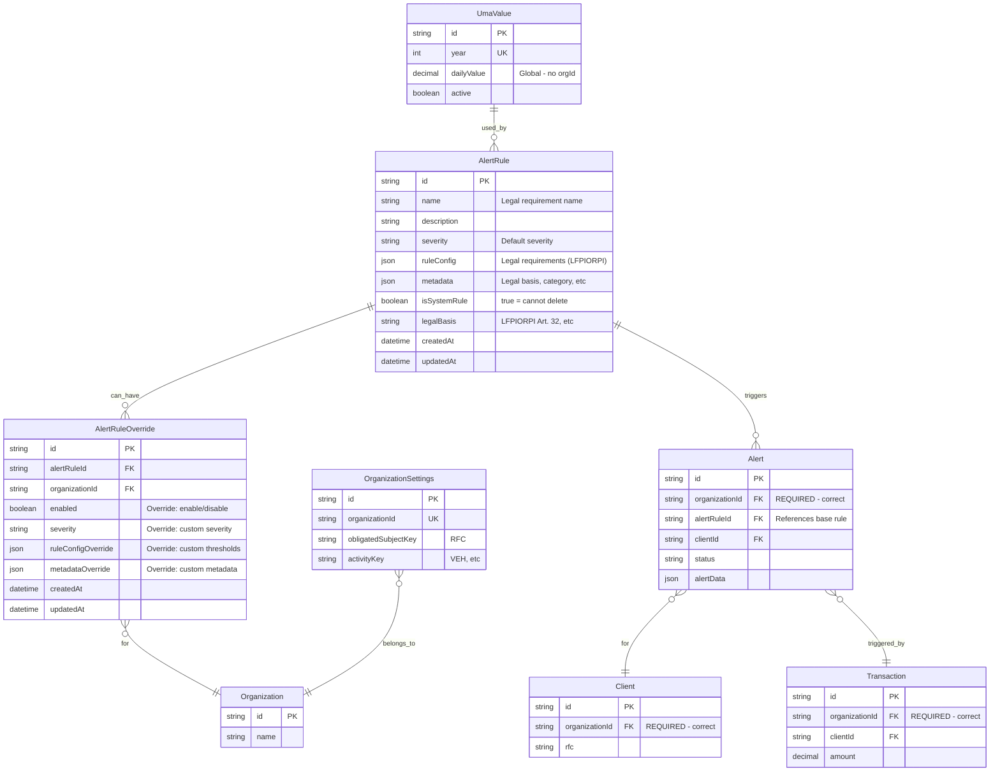

# Alert Rules Architecture Analysis

## Problem Statement

Alert rules are currently scoped by `organizationId`, but they're based on **LFPIORPI** (Ley Federal para la Prevención e Identificación de Operaciones con Recursos de Procedencia Ilícita) - Mexican federal law requirements that apply universally to all obligated subjects (sujetos obligados).

## Current Architecture

## Issues with Current Design

1. **Alert Rules are Legal Requirements**: The 6,420 UMA threshold, cash payment limits, PEP monitoring, etc. are defined by LFPIORPI and apply to ALL organizations equally.

2. **Duplication**: Each organization would need to create identical rules, leading to:

   - Data duplication
   - Maintenance overhead
   - Risk of inconsistencies
   - Seed script complexity

3. **UMA Values are Global**: `UmaValue` doesn't have `organizationId` because UMA is a national standard - alert rules should follow the same pattern.

4. **Worker Complexity**: The worker needs to know `organizationId` to fetch rules, but rules are universal.

## Proposed Architecture

## Benefits of Proposed Design

1. **Single Source of Truth**: Legal requirements defined once in `AlertRule` table
2. **Flexibility**: Organizations can override rules via `AlertRuleOverride`:
   - Enable/disable specific rules
   - Customize thresholds (within legal bounds)
   - Adjust severity levels
   - Add organization-specific metadata
3. **Consistency**: All organizations use the same base rules, ensuring compliance
4. **Simpler Worker Logic**: Worker fetches global rules, then applies organization overrides
5. **Easier Maintenance**: Update legal requirements in one place
6. **Better Compliance**: System rules can't be deleted, ensuring legal requirements are always present

## Migration Strategy

1. **Create `AlertRuleOverride` table**
2. **Migrate existing rules**:
   - Extract unique rules (by name/config) → `AlertRule` (global)
   - Create `AlertRuleOverride` entries for each organization's customizations
3. **Update queries**:
   - `listActive(organizationId)` → fetch global rules + apply overrides
   - Worker fetches global rules, applies org-specific overrides
4. **Update seed script**: Seed global rules once, not per organization

## Alternative: Simpler Approach

If organizations don't need customization, we could simply:

1. **Remove `organizationId` from `AlertRule`**
2. **Make rules global** (like `UmaValue`)
3. **Keep `organizationId` in `Alert`** (alerts are organization-specific)

This is simpler but less flexible if organizations need customization in the future.

## Recommendation

**Option 1 (Recommended)**: Implement `AlertRuleOverride` pattern for maximum flexibility while maintaining legal compliance.

**Option 2 (Simpler)**: Remove `organizationId` from `AlertRule` and make all rules global. Add `AlertRuleOverride` later if needed.

Both options are better than the current design where legal requirements are duplicated per organization.
