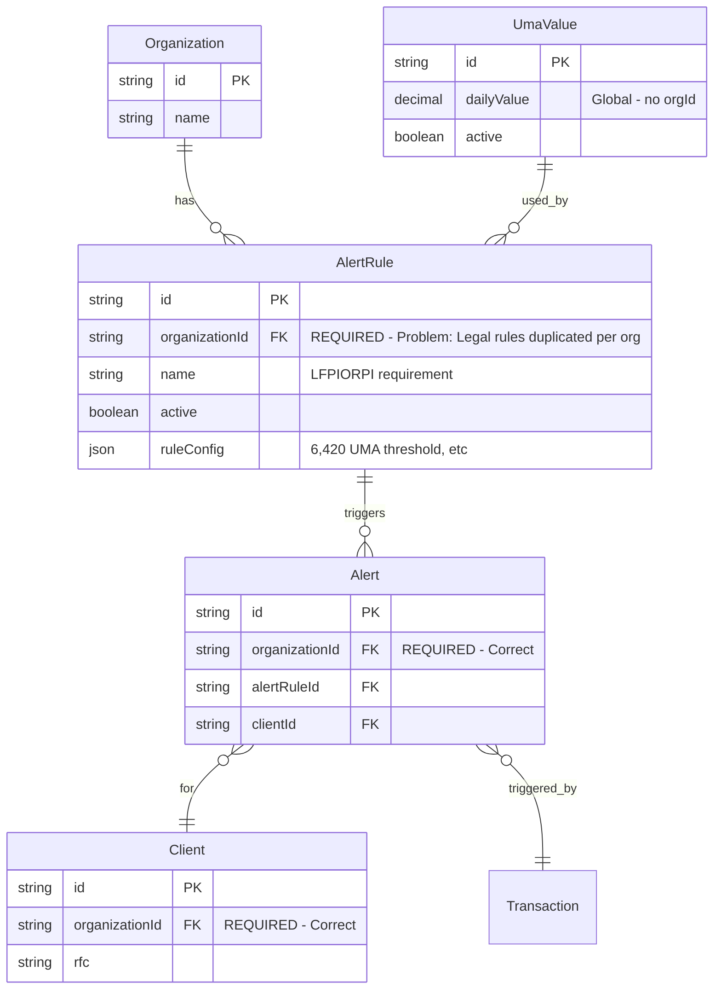
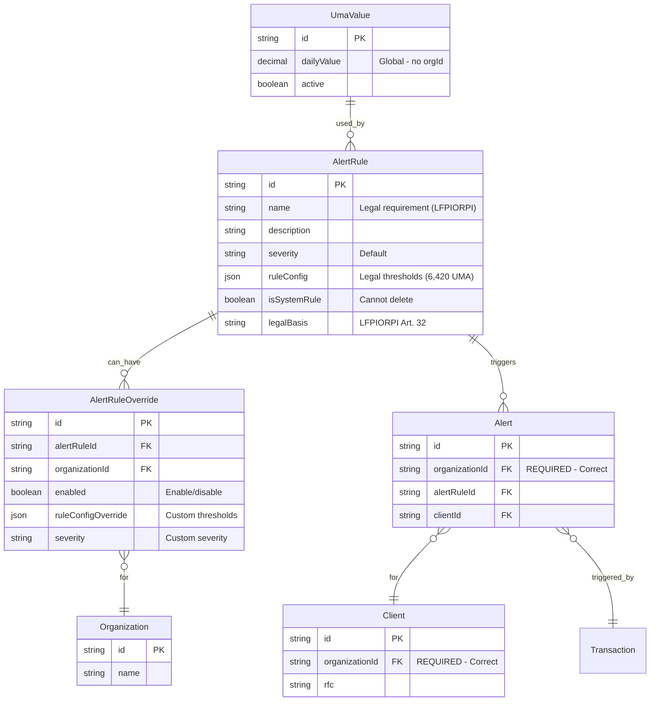

# Alert Rules ER Diagram

## Current Architecture (Problematic)

## Proposed Architecture (Recommended)

## Key Differences

| Aspect                 | Current                       | Proposed                         |
| ---------------------- | ----------------------------- | -------------------------------- |
| **Alert Rules**        | Per organization (duplicated) | Global (shared)                  |
| **Legal Requirements** | Duplicated per org            | Single source of truth           |
| **Customization**      | Edit rule directly            | Override via `AlertRuleOverride` |
| **Compliance**         | Risk of inconsistencies       | Guaranteed consistency           |
| **Maintenance**        | Update per organization       | Update once                      |
